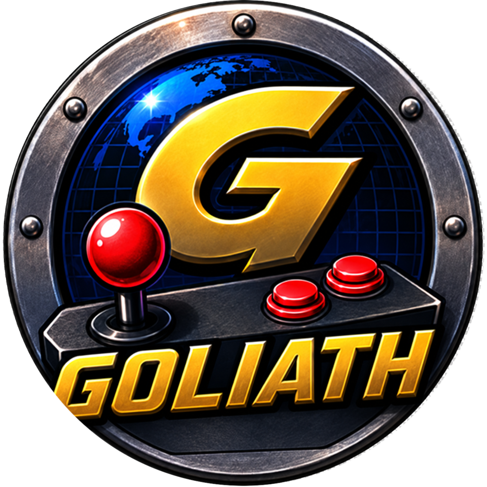
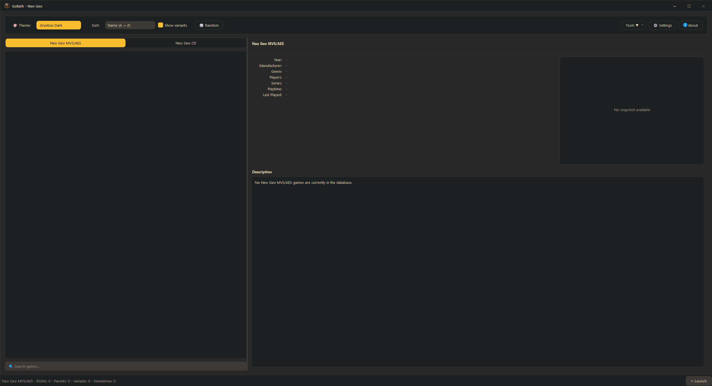
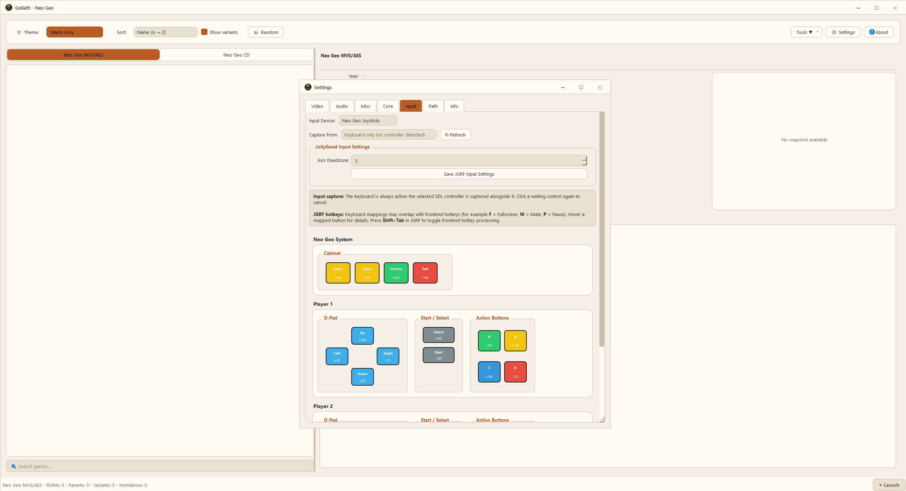
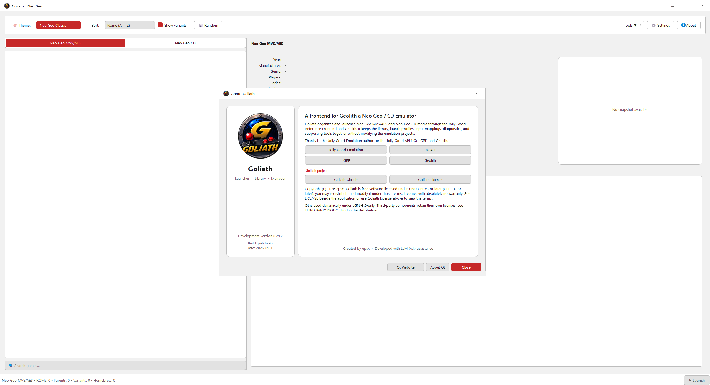

<p align="center">
  
</p>

<p align="center">
  <a href="#build-windows">Build Windows</a> ·
  <a href="#build-linux">Build Linux</a>
</p>

<p align="center"><em>Goliath was developed with LLM (A.I.) assistance.</em></p>

<p align="center">
  <a href="https://github.com/epsx/Goliath/actions/workflows/build.yml"></a>
</p>

# Goliath

Goliath is a C++20 and Qt 6 desktop frontend for Neo Geo MVS/AES and
Neo Geo CD. It organizes the game library and launches media through the
Jolly Good Reference Frontend (JGRF) and the Geolith core.

Goliath is only a frontend. Emulation is provided by JGRF, JG, and Geolith.

The project does **not** contain or provide download links for ROMs, disc
images, BIOS or firmware files, encryption keys, proprietary game artwork, or
external metadata catalogs. Users must supply their own legally obtained
content.

Windows with MSYS2 UCRT64 is the primary development and validation platform.
Linux support is maintained where practical.

## Screenshots

[](Screenshots/goliath-main-dark.png)

| Input configuration | About Goliath |
| --- | --- |
| [](Screenshots/goliath-input-settings.png) | [](Screenshots/goliath-about.png) |

## Main features

- One library for Neo Geo MVS/AES `.neo` files and Neo Geo CD `.cue`/`.chd`
  images.
- Parent and variant grouping for cartridge games.
- Recursive Neo Geo CD discovery.
- Optional local verification against MAME and Redump metadata.
- Search, persistent exact-media Favorites, name/year sorting, visible-only
  Random, snapshots, and history.
- Per-game BIOS, video, input, and core settings without changing global
  configuration.
- BIOS verification and safe JGRF BIOS preparation.
- Save-data backup, validation, restore, deletion, and folder access.
- Exact-media playtime, session count, and last-played tracking, including
  background observation after the main window is closed.
- Selected-game performance benchmark and one-shot WAV export.
- Frontend and JGRF diagnostics with guarded log controls.
- SDL3 controller mapping and asynchronous audio-device discovery.
- Twelve contrast-checked light and dark themes.

## Getting started

### What you need

- Goliath;
- a compatible JGRF installation;
- the Geolith core;
- your own legally obtained BIOS and game media;
- optional local metadata if you want identification and verification badges.

JGRF and Geolith are runtime components. Goliath does not build, download, or
update them.

To build those upstream components yourself, including JGRF with Vulkan and
Geolith with CHD support, follow
[HOWTO.md — Build and install JGRF and Geolith](HOWTO.md#7-build-and-install-jgrf-and-geolith).

### First run

1. Start `goliath-qt.exe`.
2. Open **Settings → Path** and select your JGRF executable, media folders,
   BIOS folder, and optional metadata/snapshot folders.
3. Open **Settings → Info** and confirm that JGRF, JG, and Geolith are
   detected.
4. Use **Rescan** to build the local library.
5. Select a game and choose **Launch**.

All default relative paths are resolved from the directory containing the
Goliath executable, not from the terminal's working directory.

For the complete setup, BIOS, metadata, deployment, and troubleshooting guide,
see [HOWTO.md](HOWTO.md).

## Supported media

### Neo Geo MVS/AES

Goliath scans `.neo` files. When compatible local metadata is available, it
groups parents and variants and uses the configured parent `main_rom` as the
authoritative launch file.

To convert legally obtained Neo Geo ROM data from a compatible MAME ROM-set
archive (`.zip`) to the TerraOnion `.neo` format, use
[Lithogen](https://github.com/carmiker/lithogen) and follow its upstream
instructions. Goliath does not download ROMs or perform this conversion.

### Neo Geo CD

Goliath recursively scans `.cue` and `.chd` images. Track files such as `.bin`,
`.iso`, and `.wav` are not displayed as separate games.

CHD launching is enabled only when the installed Geolith core advertises CHD
support for Neo Geo CD.

Optional verification badges include:

- `✓ Redump set` — the CUE and all referenced BIN tracks match;
- `⚠ CUE mismatch` — the tracks match, but the CUE descriptor differs;
- `✓ MAME set` — the CHD internal combined SHA-1 matches;
- metadata-only or unknown when content cannot be verified.

External metadata is user-supplied runtime input and is not included in the
Goliath repository or release packages.

## Everyday use

The main library supports live search, parent/variant browsing, explicit
sorting, visible-only Random selection, context actions, and a details panel.
Selection and search are preserved across sorting, rescans, and view rebuilds.

Use the **☆ Favorite** button or a game's context menu to add the exact
selected parent, variant, CUE, or CHD. **★ Favorites only** filters the current
system without hiding a favorite variant behind its parent; Random selects
only favorite media while this filter is active.

Use **Tools** or a game's context menu for:

- per-game settings;
- save-data management;
- performance benchmarking;
- WAV audio export;
- diagnostics and log controls;
- opening relevant media or configuration folders.

Per-game profiles, playtime, and Favorites are stored separately from the
generated game database, so rescanning does not remove them.

## Build from source

<a id="build-windows"></a>

### Windows — MSYS2 UCRT64

Install the build dependencies from the UCRT64 shell:

```bash
pacman -S \
  mingw-w64-ucrt-x86_64-gcc \
  mingw-w64-ucrt-x86_64-cmake \
  mingw-w64-ucrt-x86_64-qt6-base \
  mingw-w64-ucrt-x86_64-sdl3 \
  mingw-w64-ucrt-x86_64-ninja
```

Configure and build:

```bash
cmake -S . -B build -G Ninja -DCMAKE_BUILD_TYPE=Release
cmake --build build -j$(nproc)
```

Outputs:

```text
build/goliath-qt.exe
```

The normal build produces only the application.

<a id="build-linux"></a>

### Linux

Install the compiler, CMake, Ninja, Qt 6 Widgets development files, and SDL3
development files for your distribution.

Debian or Ubuntu:

```bash
sudo apt update
sudo apt install build-essential cmake ninja-build qt6-base-dev libsdl3-dev
```

Fedora:

```bash
sudo dnf install gcc-c++ cmake ninja-build qt6-qtbase-devel SDL3-devel
```

Arch Linux:

```bash
sudo pacman -S --needed base-devel cmake ninja qt6-base sdl3
```

Then configure and build Goliath:

```bash
cmake -S . -B build -G Ninja \
  -DCMAKE_BUILD_TYPE=Release \
  -DBUILD_TESTS=OFF
cmake --build build -j$(nproc)
```

The executable is created at:

```text
build/goliath-qt
```

Run it from the repository root with:

```bash
./build/goliath-qt
```

Package names can vary on older distribution releases. CMake must be able to
locate both Qt 6 Widgets and the SDL3 CMake package before configuration can
complete.

Tests are disabled by default. Developers and CI builds can enable them with
`-DBUILD_TESTS=ON` as shown below.

## Prepare a runnable folder

### Windows

Create a clean staging directory and deploy the Qt runtime from the MSYS2
UCRT64 shell:

```bash
stage=dist/Goliath
mkdir -p "$stage"

cp build/goliath-qt.exe LICENSE THIRD-PARTY-NOTICES.md "$stage/"
cp -a licenses "$stage/"

windeployqt6.exe --release --dir "$stage" "$stage/goliath-qt.exe"
cp /ucrt64/bin/SDL3.dll "$stage/"

ldd "$stage/goliath-qt.exe"
```

Some Qt packages name the deployment tool `windeployqt.exe` instead. `ldd`
must report no missing dependency before the package is tested on a clean
Windows PC without MSYS2.

Add the compatible JGRF runtime, Geolith core and its actual DLL dependencies,
and JGRF `shaders/*.spv` files when Vulkan is enabled. Do not add
`goliath-qt-tests.exe` to the user package.

### Linux

Create the basic staging directory and inspect its shared-library requirements:

```bash
stage=dist/Goliath
mkdir -p "$stage"

cp build/goliath-qt LICENSE THIRD-PARTY-NOTICES.md "$stage/"
cp -a licenses "$stage/"

ldd "$stage/goliath-qt"
```

`ldd` is an inspection tool; it does not create a portable Linux package.
Install the reported Qt 6 and SDL3 dependencies through the target
distribution, or use a dedicated AppImage/package workflow. Do not blindly
bundle glibc or every `.so` path printed by the build machine.

GitHub Actions builds and tests every push and pull request on Windows MSYS2
UCRT64 and Linux. Successful runs provide separate downloadable frontend build
artifacts for both platforms from the workflow run page.

The Windows artifact contains Goliath, its detected Qt, SDL3, and transitive
MSYS2 runtime DLLs, together with matching license materials. CI verifies the
license checksum manifest and requires a retained MSYS2 license directory for
every top-level DLL owned by an installed package. The Linux artifact contains
the Goliath binary, license materials, and an `ldd` dependency report; it is a
build artifact, not an AppImage or distribution-independent package.

These CI artifacts intentionally exclude JGRF, Geolith, BIOS, game media,
metadata, configuration, and user data. A full release must add and validate
the matching JGRF/Geolith runtime separately.

## Tests

Configure a separate test build:

```bash
cmake -S . -B build-tests -G Ninja \
  -DCMAKE_BUILD_TYPE=Release \
  -DBUILD_TESTS=ON
cmake --build build-tests -j$(nproc)
```

Run the complete suite through CTest:

```bash
ctest --test-dir build-tests --output-on-failure
```

Or run the Catch2 executable directly:

```bash
./build-tests/goliath-qt-tests
```

`goliath-qt-tests` (`goliath-qt-tests.exe` on Windows) is only the regression
test runner. Do not copy it into a user package.

Some negative tests intentionally print rejection diagnostics. They are not
failures when the final test result passes.

## Runtime layout

A typical portable Windows layout is:

```text
Goliath/
├── goliath-qt.exe
├── jollygood.exe
├── cores/
│   └── geolith/
│       └── geolith.dll
├── shaders/                 JGRF Vulkan assets, when required
├── bios/                    user-supplied
├── roms/                    user-supplied
├── neocd/                   user-supplied
├── metadata/                optional user-supplied catalogs
├── config/                  generated configuration and profiles
├── database/                generated library and hash cache
├── data/                    JGRF data and Goliath backups/exports
├── LICENSE
├── THIRD-PARTY-NOTICES.md
└── licenses/
```

Preserve the upstream JGRF runtime layout instead of copying only its
executable and core. Vulkan-enabled deployments also require the matching JGRF
shader files.

Detailed Windows deployment instructions are in
[HOWTO.md](HOWTO.md#12-deploy-locally-and-on-a-clean-windows-pc).

## Known limitations

- Windows is the primary tested platform; Linux support is practical rather
  than release-certified.
- Neo Geo CD CHD startup can take several seconds in both Goliath and direct
  JGRF use.
- Stock JGRF keys live save/state files by a bounded media basename. Different
  media paths with the same resulting basename can therefore share live data.
- Save-data mutation is automatically blocked only for JGRF processes tracked
  by the current Goliath session.
- The validated Windows OpenGL ES runtime uses the documented compatibility
  fix described in
  [WINDOWS_OPENGL_ES_WGL_RUNTIME_FIX.md](docs/WINDOWS_OPENGL_ES_WGL_RUNTIME_FIX.md).

## Project documentation

- [HOWTO.md](HOWTO.md) — setup, build, runtime preparation, deployment, and
  troubleshooting;
- [STRUCTURA.md](STRUCTURA.md) — detailed architecture and source ownership;
- [HISTORY.md](HISTORY.md) — implementation and validation history;
- [THIRD-PARTY-NOTICES.md](THIRD-PARTY-NOTICES.md) — dependency and license
  inventory;
- [RELEASE_COMPLIANCE.md](docs/RELEASE_COMPLIANCE.md) — source and licensing
  checklist for public releases.

## Credits

Goliath integrates with the public interfaces of
[Jolly Good Emulation](https://jgemu.gitlab.io/),
[JG](https://gitlab.com/jgemu/jg),
[JGRF](https://gitlab.com/jgemu/jgrf), and
[Geolith](https://gitlab.com/jgemu/geolith).

Goliath is an independent project and is not affiliated with, sponsored by,
or endorsed by the identified third-party projects or trademark owners.

## License

Goliath's original project material is licensed under the
**GNU General Public License, version 3 or later** (`GPL-3.0-or-later`). See
[LICENSE](LICENSE).

Third-party components retain their own licenses. See
[THIRD-PARTY-NOTICES.md](THIRD-PARTY-NOTICES.md) and the complete
[`licenses/`](licenses/) directory.

The software is provided without warranty under the terms of its license.
Users are responsible for supplying and using content for which they have the
necessary rights.
